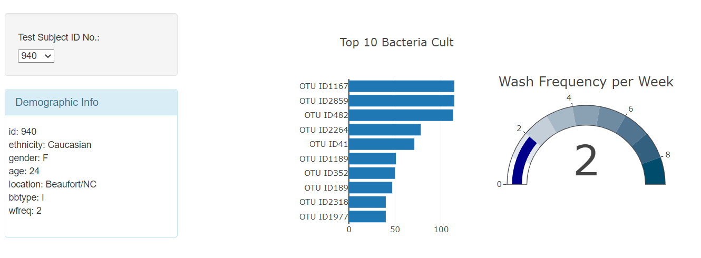

# Bacteria samples visualized with Plotly

The purpose of this project was to practice using Plotly with JavaScript 
to create interactive data visualizations for websites. I used a sample dataset in JSON 
format that represents a study of the bacteria cultures in test subjects' 
belly buttons. The dashboard created displays metadata for each 
test subject, a bar chart that shows the top 10 cultures found from each subject, a gauge chart displaying wash frequency, and a bubble chart
showing all strains and their concentrations. All visualizations employed Plotly, and the charts 
update each time a new test subject ID is chosen from the drop down menu.  

#### To see the website use the link below and choose a new test subject id to see it update.

https://dkogel.github.io/Bacteria-samples-visualized-with-plotly/
  
  ---  
  
Daniel Kogel  
dkogel123@gmail.com  
www.linkedin.com/in/daniel-kogel  

